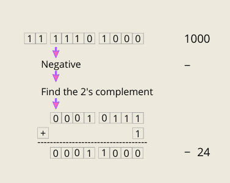
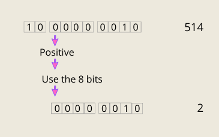

> This story was originally published on [Medium](https://towardsdatascience.com/unsinged-signed-integers-and-casting-in-rust-9a847bfc398f)

Follow me:
- [@shinokada](https://twitter.com/shinokada)
- [Medium](https://medium.com/@shinichiokada)

# Casting to a Signed Type

## Method 1

This is the same as above but you need to be aware that the min/max number of the data type.

`i8`'s min and max numbers are -128 and 127. So the number needs to be between them.

Casting 128 to `i8` :

```
128-256=-128
```

Casting 1000 to i8:

```
1000 - 256 = 744
1000 - 256 - 256 = 488
1000 - 256 - 256 - 256 = 232
1000 - 256 - 256 - 256 - 256 = -24
```

```rust runnable
fn main() {
    println!("128 as a i8 is : {}", 128 as i8);
    println!("1000 as a i8 is : {}", 1000 as i8);
    println!("232 as a i8 is : {}", 232 as i8);
    println!("257 as a i8 is : {}", 257 as i8);
    println!("130 as a i8 is : {}", 130 as i8);
    println!("514 as a i8 is : {}", 514 as i8);
}
```

## Method 2

1000₁₀ in decimal is 11 **1**110 1000₂ in binary. The MSB within 8-bit is 1, so it is a negative number. Then use 2’s complement. The complement is 00010111₂ and we add 1₂ becomes 00011000₂. Finally, it is -24₁₀.



When the MSB within 8-bit is 0, it is a positive number. Then take the first 8 least significant bits (LSB).


