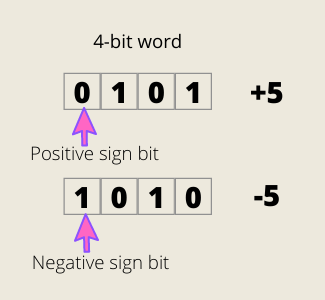

> This story was originally published on [Medium](https://towardsdatascience.com/unsinged-signed-integers-and-casting-in-rust-9a847bfc398f)

Follow me:
- [@shinokada](https://twitter.com/shinokada)
- [Medium](https://medium.com/@shinichiokada)

# Ones' Complement

The first bit (MSB) is the same as the signed magnitude. It tells a positive by 0 or negative by 1. 

The rest of the bits will take the compliment, which means if it is 1 the complement is 0 and if it is 0, then the complement is 1.

The signed ones’ complement has the same problem as the signed magnitude. There are two zeros, `0000` and `1111`.