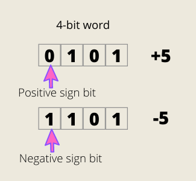

> This story was originally published on [Medium](https://towardsdatascience.com/unsinged-signed-integers-and-casting-in-rust-9a847bfc398f)

Follow me:
- [@shinokada](https://twitter.com/shinokada)
- [Medium](https://medium.com/@shinichiokada)

# Signed, Ones' Complement and Two's Complement

In computing, **signed number representations** are required to encode negative numbers in binary number systems. Let’s examine [sign-and-magnitude](https://www.wikiwand.com/en/Signed_number_representations#Sign-and-magnitude_method), [ones’ complement](https://www.wikiwand.com/en/Signed_number_representations#Ones'_complement), and [two’s complement](https://www.wikiwand.com/en/Signed_number_representations#Two's_complement).

# Sign-and-Magnitude

**Sign-and-Magnitude** is also called **Signed Magnitude**. The first bit (called the most significant bit or MSB) tells if it is positive by 0 or a negative by 1. The rest is called magnitude bits.

As I mentioned it before that signed integer types have the min and the max from **-(2ⁿ⁻¹) to 2ⁿ⁻¹-1** where n stands for the number of bits. Since we use the first bit for the positive and negative signs we have `n-1` in the **2ⁿ⁻¹**.

For 4-bit the min and max are from -(2³) to 2³–1, which is -8 to +7.

As you see in the diagram above, the positive and the negative have the same digits except for the sign bit.

The problem of the signed magnitude is that there are two zeros, `0000` and `1000`.