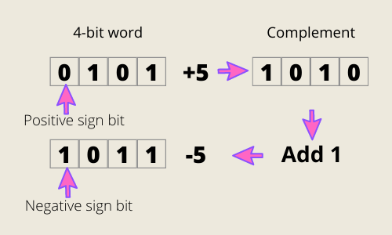
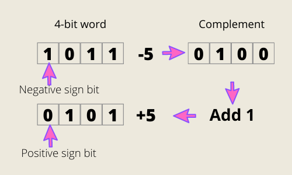

> This story was originally published on [Medium](https://towardsdatascience.com/unsinged-signed-integers-and-casting-in-rust-9a847bfc398f)

Follow me:
- [@shinokada](https://twitter.com/shinokada)
- [Medium](https://medium.com/@shinichiokada)

# Two's Complement

In the **binary** numbering system, the radix (base) is two. That’s why the radix complement is called two’s complement and the diminished radix complement is called ones’ complement.

Two’s complement can avoid multiple representations of 0, and it avoids keeping track of carrying bits in case of overflow.

We again use the first bit (MSB) for the `+` and `-` signs. We take the complement of the number and we add `1` to get the opposite number. This works from positive to negative and vice versa.

For zero that is `0000` in the binary, the complement is `1111` and adding `1` results in `1 0000`. The `1` is called an "overflow" bit. 

Overflow occurs when the sum of the most significant (left-most) column produces a carry forward. This overflow or carry bit can be ignored.
